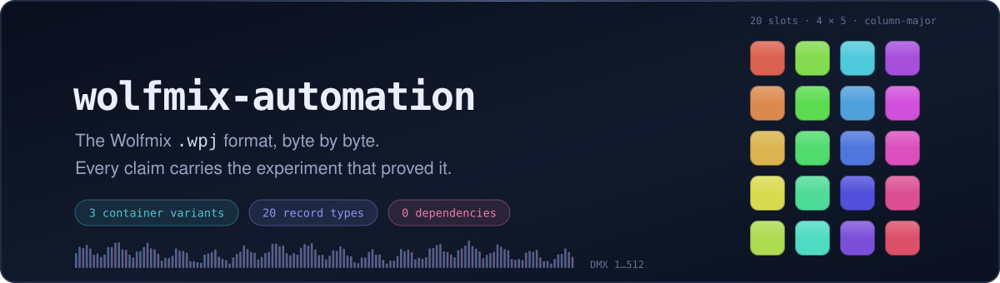
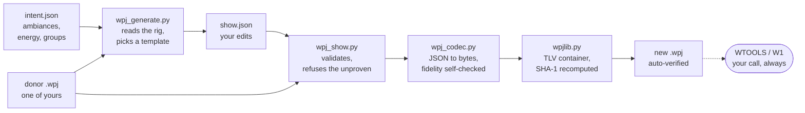

<div align="center">



# wolfmix-automation

**Read, decode, diff and rebuild Wolfmix `.wpj` project files — and drive a Wolfmix W1 over USB — from the command line.**

*Offline. Python standard library only. No dependencies, no uploads, no guessing.*

[](LICENSE)
[](#requirements)
[](research/versions.md)
[](research/versions.md)
[](#requirements)
[](#where-the-format-stands)

[**What is this?**](#what-is-this) ·
[**Quick start**](#quick-start) ·
[**How it works**](#how-it-works) ·
[**Format status**](#where-the-format-stands) ·
[**Docs**](#documentation) ·
[**FAQ**](#faq)

</div>

---

## What is this?

The Wolfmix W1 is a standalone DMX lighting controller. Its projects are `.wpj`
files, and **the manufacturer does not publish that format**. So you cannot
generate a show from a script, diff two versions of a rig, or check a project
into version control in any meaningful way.

This repository is the result of taking that format apart — by reading files we
own, changing one parameter at a time in the vendor's own editor, and watching
what our own controller does on its USB link and on its DMX output.

It gives you two things.

**📄 A specification** — [`SPEC.md`](SPEC.md) describes the `.wpj` format byte by
byte: 3 container variants, 20 record types, the patch model, presets, FX, the
static palettes. Every claim carries its evidence status and the experiment
that produced it.

**🛠 Tools that use it** — a container writer with a proven byte-identical
round-trip, a codec that verifies its own fidelity, a show compiler, and a
client for the controller's USB protocol.

> [!NOTE]
> **What this is not.** Not an official tool, not affiliated with Wolfmix or
> Nicolaudie, and not a finished product. It is careful research with runnable
> proofs attached. Fields that have not been proven are not writable, on
> purpose — see [the rules](#the-rules-that-shape-the-code).

## Requirements

| What | Detail |
|---|---|
| **Python** | 3.x, standard library only — no `pip install`, no virtualenv. Developed on 3.14. |
| **OS** | macOS or Linux. Only the device client is OS-sensitive (POSIX serial). |
| **A project file** | One of your own. **None ship with this repository** — [here is why](LEGAL.md). |
| **Hardware** *(optional)* | A Wolfmix W1 Mk1 on USB, with WTOOLS closed. Everything else works on files alone. |

## Quick start

### 1 · Get the code

```bash
git clone https://github.com/Adridot/wolfmix-automation.git
cd wolfmix-automation
```

### 2 · Bring a project of your own

```bash
mkdir -p corpus/projects
cp ~/Library/Application\ Support/WTOOLS/wlinkData/projects/*.wpj corpus/projects/
```

<details>
<summary>No WTOOLS install? Pull one straight off the controller</summary>

```bash
python3 tools/wolfmix.py projects                       # list what is on the W1
python3 tools/wolfmix.py project <UUID> corpus/projects/mine.wpj
```

This is a read. Nothing is written to the device. Keep WTOOLS closed — the
serial port is exclusive.

</details>

Copies only — never work on the originals. Full guide: [`docs/corpus.md`](docs/corpus.md).

### 3 · Prove the tools work on *your* files

```bash
make check
```

```text
self-check ok : round-trip octet-identique sur 45 fichiers
fidélité octet vérifiée sur 45 fichiers variante A
16 identités vérifiées sur 45 fichiers variante A (+ paires F30-04 / FLASH-09)
self-check ok : 12/12 tilt, 11/12 pan, offsets et clamp
wpj_privacy : 13 motifs, aucune occurrence dans 58 fichiers suivis
```

Eight self-checks: byte-identical round-trip, codec fidelity per record type,
wire parsing, the show compiler, the inspect API, the structural identities, the
position model against four DMX captures, and the anonymisation guard.

> [!IMPORTANT]
> With no project files present, the self-checks **abstain** — one line each,
> exit code 0. Nothing was verified, and they will not pretend otherwise.

### 4 · Look inside a project

```bash
python3 tools/wpj_api.py corpus/projects/your-project.wpj | head -40
```

<details>
<summary>What comes out (trimmed)</summary>

```jsonc
{
  "modelVersion": "1",
  "project": { "name": "MY SHOW", "warnings": [],
               "known": { "colorFxPalette": { "pads": [ { "index": 1, "red": 255 } ] } } },
  "presets": [
    { "id": 33, "page": 2, "slot": 14, "name": "Chaser", "rawPreserved": true,
      "known": { "colorFx1": { "type": 2, "speedPercent": 120, "linkOrder": 10 } } }
  ],
  "fixtures": { "status": "partial",
                "items": [ { "profil": 57, "offset_106": 44, "fixture": 7, "nb_entrees_106": 4 } ] },
  "validation": {
    "checksumOk": true,
    "issues": [
      { "severity": "info", "code": "checksum_ok",
        "message": "SHA-1 header over bytes[20:] verified" },
      { "severity": "warning", "code": "unconfirmed_field_attribution",
        "message": "field attribution still hypothesized: fadePercent, phasePercent, sizePercent" }
    ]
  },
  "unknown_tlvs": [ { "type": 106, "payloadLength": 600, "rawPreserved": true } ]
}
```

Same response shape as the `wpj-toolkit` inspect schema, computed locally so
tooling written against it works offline. Note the second issue: attributions
that are **still hypotheses are emitted with a warning attached**, never as
plain values. `x_records` (omitted above) carries the full codec decode so
nothing is lost.

</details>

### 5 · Compile a show

Editing always starts from a donor project. Nothing is synthesised from scratch.

```jsonc
// show.json
{
  "base": "corpus/projects/your-project.wpj",
  "nom": "MY SHOW",
  "presets": [
    { "id": 33, "nom": "Chaser", "color_fx1": { "effet": 2, "vitesse": 120 } }
  ],
  "positions": [
    { "page": 1, "index": 0, "nom": "Public", "pan": 32768, "tilt": 15073 }
  ]
}
```

```bash
python3 tools/wpj_show.py compile show.json out.wpj
```

The compiler refuses any key outside what has been proven, writes to a **new**
file, then reloads its own output and checks that every requested value reads
back and that **nothing else moved**. Key reference: [`docs/show-format.md`](docs/show-format.md).

## How it works



Three properties hold at every stage:

1. **Unknown bytes pass through verbatim.** A record with no schema is
   re-emitted exactly as it came in. The codec proves this on your whole corpus
   before it will run.
2. **Writes never overwrite.** Every output opens with mode `x`; an existing
   path is an error, not a target.
3. **Nothing is written to the controller** except by the experiment runner,
   and then only to its own UUIDs, verified by reading them back.

## What's in the box

| Tool | One line |
|---|---|
| [`wpjlib.py`](tools/wpjlib.py) | The container. TLV split, reassembly, SHA-1 recomputed, byte-identical round-trip. |
| [`wpj_codec.py`](tools/wpj_codec.py) | Semantic JSON ↔ bytes per record type. `decode` verifies its own round-trip or falls back to raw hex. |
| [`wpj_identities.py`](tools/wpj_identities.py) | Arithmetic identities between records — refutes a wrong reading without touching hardware. |
| [`wpj_show.py`](tools/wpj_show.py) | The show compiler: an edit spec applied to a donor, auto-verified. |
| [`wpj_generate.py`](tools/wpj_generate.py) | The show generator: ambiances, energy and groups in, a preset bank out — the rig read from the donor. |
| [`wpj_api.py`](tools/wpj_api.py) | Inspect JSON in the `wpj-toolkit` schema shape, local and offline. |
| [`wpj_inspect.py`](tools/wpj_inspect.py) | Protobuf wire walk for variants B/C. Exits 2 rather than guess. |
| [`wpj_diff.py`](tools/wpj_diff.py) | Byte-range diff — the first command of every experiment. |
| [`wolfmix.py`](tools/wolfmix.py) | The device: settings, projects, download, live DMX, mode watch. |
| [`wolfmix_experiment.py`](tools/wolfmix_experiment.py) | Transactional experiments: snapshot → deploy → verify → restore on failure. |
| [`wpj_position.py`](tools/wpj_position.py) | The position model, executable: the DMX a recalled position emits, computed from the project alone. |
| [`wpj_privacy.py`](tools/wpj_privacy.py) | The anonymisation guard: fails `make check` if a real name reaches a tracked file. |

Run any of them with **no arguments** to execute its self-check — except
`wolfmix.py` and `wolfmix_experiment.py`, which take it as a subcommand
(`python3 tools/wolfmix.py self-test`), and `tlv.py` / `dump.py`, which are
argument-only helpers.

## Where the format stands

| Area | State |
|---|---|
| Variant-A container, SHA-1 header, project name | 🟢 **device-confirmed** — our files are accepted and stored byte-identically |
| Record inventory — 20 types | 🟢 14 decoded, 6 round-tripped verbatim |
| Patch model (105/106/110/111/115/116/120/125) | 🟢 locked by arithmetic — **16 identities** re-checked on every file; the DMX address is `115.f2`, confirmed on live DMX |
| Static palettes — colour, gobo, position (140/145/150) | 🟢 **device-confirmed**, one record per group A–H |
| Positions, end to end (150/151/106) | 🟢 **device-confirmed** — fan, per-fixture offsets, clamping and travel limits; the emitted DMX is computable from the file alone |
| FX sequences (155) | 🟢 **device-confirmed** — 16 steps × 8 groups, step-major, packed varints |
| Flash keys in a preset (165 `f16`) | 🟢 **device-confirmed both ways** — five slices captured from the panel and written back |
| Flash FX settings (102) | 🟢 ten of eleven fields **device-confirmed**; `f11` alone stays unattributed and inert, and the search is stopped |
| Presets — the per-group arrays (165) | 🟢 thirteen fields proven per-group; four named and **device-confirmed** |
| Presets — writing new entries | 🟡 append works; names are capped at **19 bytes** or the project refuses to open |
| Presets — FX submessage (165) | 🟡 effect type device-confirmed; `f4` reads as a permission mask; `f6`/`f9` unattributed between four screen properties |
| UI mode enum (`WM_MODE_*`) | 🟡 **29 values device-confirmed** on the panel, never read out of a binary |
| Hands-off preset recall over USB | 🟢 **device-confirmed** — the short events are not protobuf at all: the firmware reads `payload[0]` as the index |
| Variants B and C | 🔴 top level only — read-only by rule |
| The DMX mapping record | 🔴 not located. MIDI mapping is **MK2 and higher**, so it cannot exist in this MK1 corpus |

<details>
<summary><b>A worked example: the gobo palette is not stored, it is derived</b></summary>

Record 145 looked like 20 stored gobo slots per group. It is not. Its image ids
are exactly the `f4` values of record 111's gobo-wheel ranges, in wire order —
so **the palette is generated from the patch**. Two consequences:

- the identity is checkable on any corpus, forever, by `wpj_identities.py`;
- it predicts DMX. Pressing pad *n* should drive the group's gobo channel to
  the **lower bound** of range *n*. Measured: pad 1 → 7, pad 10 → 70, and
  nothing else moved in 2048 channels beyond a ±1 dither on three channels that
  was already there in the baseline. Measured on one group of one rig with one
  fixture profile — the general rule is **[hypothesized]** until another is
  exercised.

That is the standard this repository holds itself to: a reading that predicts
an observation, then the observation.

</details>

<details>
<summary><b>A second worked example: the payload that was never protobuf</b></summary>

Every message in the controller's USB protocol is protobuf-shaped, so recalling
a preset was encoded as protobuf too. It never addressed anything: whatever
value we sent, the device produced one of two fixed outputs. Two sessions were
spent measuring that, and one reading — "the event carries no target" — reached
`device-confirmed` before it was retracted.

The answer came from sweeping the neighbouring event and noticing the modes it
selected: 8, 16, 24, 32. Those are `0x08 0x10 0x18 0x20` — the protobuf **tag
bytes**. For these short events the firmware does not parse; it reads
`payload[0]`. We had been sending the tag and calling the rest a value.

One-byte payloads, and the recall is addressed, deterministic and reproducible.
The retraction is kept in `research/` alongside the fix, because the mistake —
assuming the encoding from the neighbours — is more instructive than the result.

</details>

## The rules that shape the code

These five explain both what is here and what is deliberately missing.

| # | Rule | Consequence you will notice |
|---|---|---|
| 1 | **Experimental truth** | Every claim carries a status: `observed → hypothesized → correlated → validated → device-confirmed` |
| 2 | **Read before write** | A field becomes writable only after a byte-identical round-trip *and* a differential validation *and* acceptance downstream |
| 3 | **Hardware is sacred** | No firmware operations, no fuzzing a connected device, dangerous functions off by default |
| 4 | **Local only** | Nothing leaves the machine — no upload, no third-party API, ever |
| 5 | **Honest compatibility** | "Compatible" means a tested cell in [`research/versions.md`](research/versions.md), nothing more |

## Repository map

```text
SPEC.md            the format, byte by byte, with evidence status per claim
LEGAL.md           what is not distributed here, and why
PROVENANCE.md      sources, licences, what may be reused from where
AGENTS.md          orientation for coding agents and automated contributors
tools/             the implementation — stdlib only, self-checking
docs/              task-oriented guides (corpus, tools, show format, device…)
research/          the working log, in French — one write-up per experiment
corpus/            where you drop your own projects; ships only hashes, a
                   README and the experiment recipes
```

> [!TIP]
> **Where the truth lives.** `research/` is the lab notebook and always leads.
> `SPEC.md` is the consolidated, English-language read of it. When the two
> disagree, `research/` is newer — and that gap is itself recorded.

## For AI agents

Reading this repository automatically? Start with [`AGENTS.md`](AGENTS.md): it
states the invariants, the one command that proves the tree is healthy, the
vocabulary of evidence, and the actions that are refused here. Then
[`SPEC.md`](SPEC.md) for the format and [`docs/tools.md`](docs/tools.md) for the
interfaces. The self-checks are the ground truth — if `make check` passes on a
real corpus, the structural claims hold.

## FAQ

<details>
<summary><b>Do I need a Wolfmix W1?</b></summary>

No. Everything except `wolfmix.py` and `wolfmix_experiment.py` works on files
alone. You do need a project file of your own to point the tools at.

</details>

<details>
<summary><b>Why don't you ship a sample project?</b></summary>

Because a `.wpj` is not ours to give away. About 70 of the ~78 printable
strings in one are byte-identical across unrelated rigs — the manufacturer's
factory presets, macros and position names. Every file also embeds fixture
profile data from the vendor's library, plus somebody's real show. There is no
"small clean" project file. Full reasoning: [`LEGAL.md`](LEGAL.md).

</details>

<details>
<summary><b>Why does <code>make check</code> say it verified nothing?</b></summary>

Because you have no corpus yet — see [`docs/corpus.md`](docs/corpus.md). An
abstention is reported as an abstention. The alternative would be a green tick
that means nothing.

</details>

<details>
<summary><b>Why can't I edit field X?</b></summary>

Because it has not been proven yet. The compiler covers records 101, 165, 150
and 135, and only keys at status `correlated` or better. `size`/`fade`/`phase`
are readable but not writable. See [`SPEC.md`](SPEC.md) §10–11.

</details>

<details>
<summary><b>What are the three file variants?</b></summary>

**A** — SHA-1 + a TLV container (root type 100). The device/WLINK-side format,
and the only one writable here.
**B** — SHA-1 + bare protobuf. Most current WTOOLS projects.
**C** — bare protobuf, no digest. Older.
Details in [`SPEC.md`](SPEC.md) §1.

</details>

<details>
<summary><b>Does anything get uploaded to a hosted service?</b></summary>

No. `wpj_api.py` reproduces that schema's *response shape* locally so tooling
written against it works offline. Calling a third-party decoder would break
both the local-only rule and the evidence chain. See [`PROVENANCE.md`](PROVENANCE.md).

</details>

<details>
<summary><b>Is the W1 Mk2 supported?</b></summary>

Untested. External work suggests Mk2 files use our variant A container, but
nothing measured here is Mk2, so no claim is made.

</details>

<details>
<summary><b>Why is the research in French?</b></summary>

Deliberately — `research/` is the author's lab notebook. `SPEC.md`, `LEGAL.md`,
`PROVENANCE.md`, `docs/` and this README are English. Some tool output strings
are still French.

</details>

## Roadmap

| State | Item |
|---|---|
| ✅ | Variant-A writer with a byte-identical round-trip, device-confirmed |
| ✅ | Record inventory, patch model, preset/FX sub-message |
| ✅ | Static colour / gobo / position palettes, FX sequences |
| ✅ | The position model — six records, one formula, checked against live DMX |
| ✅ | Record 102 closed but for one inert field; the five flash slices, both directions |
| ✅ | Template-based show compiler, transactional device experiment runner |
| ✅ | The anonymisation guard, wired into `make check` |
| 🔜 | `f6`/`f9` in the FX submessage — four screen properties, three fields, one save each |
| 🔜 | Whether that index byte is a preset **id** or an entry **position**, and whether a second byte is read |
| 🔜 | A generator that writes a page of presets end to end, within the 19-byte cap |
| 🔮 | The DMX mapping record — live control on MK1 |
| 🔮 | Variant B/C writer, fixture profile generation |

## Documentation

| Document | Read it when |
|---|---|
| [`docs/corpus.md`](docs/corpus.md) | you are starting out and need files to work on |
| [`docs/tools.md`](docs/tools.md) | you want the CLI surface, flags and exit codes |
| [`docs/show-format.md`](docs/show-format.md) | you are writing a `show.json` |
| [`docs/device.md`](docs/device.md) | you are talking to a real controller |
| [`docs/methodology.md`](docs/methodology.md) | you want to *add* a finding, not just use one |
| [`docs/troubleshooting.md`](docs/troubleshooting.md) | something printed a message you did not expect |
| [`SPEC.md`](SPEC.md) | you need the bytes |
| [`LEGAL.md`](LEGAL.md) · [`PROVENANCE.md`](PROVENANCE.md) | you are reusing, forking or publishing any of this |
| [`CONTRIBUTING.md`](CONTRIBUTING.md) · [`SECURITY.md`](SECURITY.md) | you are sending something back |

## Contributing

The bar here is **evidence, not code style**. A patch that adds a field
interpretation comes with the experiment that produced it: the exact
single-variable manipulation, the before/after hashes, the diff, and the status
it reaches.

- [`CONTRIBUTING.md`](CONTRIBUTING.md) — what a contribution must carry, and the
  rules any patch respects
- [`docs/methodology.md`](docs/methodology.md) — the method itself
- [`CODE_OF_CONDUCT.md`](CODE_OF_CONDUCT.md) · [`SECURITY.md`](SECURITY.md)

One rule is worth repeating here: **no project file, vendor document or
extracted resource in a commit.** `.gitignore` is there to catch it; do not work
around it.

Recording that something is *not* what it looked like is as valuable here as
recording what it is.

## License

[MIT](LICENSE) — chosen to match `wpj-toolkit` so reuse works in both directions.

## Acknowledgements

- [**gitfeber/wpj-toolkit**](https://github.com/gitfeber/wpj-toolkit) (MIT) — FX
  enumerations, the preset identity formula, the palette channel order and the
  inspect response shape, attributed field by field in [`PROVENANCE.md`](PROVENANCE.md).
- [**mseerig/wolfmix-web-remote**](https://github.com/mseerig/wolfmix-web-remote)
  — two hardware-observed MIDI facts, cited only, not copied.
- **forum.wolfmix.com** — staff and user statements, quoted with thread ids.

---

<div align="center">

<sub>Wolfmix, Wolfmix W1, WTOOLS, WLINK and Nicolaudie are trademarks of their respective owners.</sub>

<sub>This project is independent and is not affiliated with, endorsed by, or sponsored by any of them.</sub>

</div>
